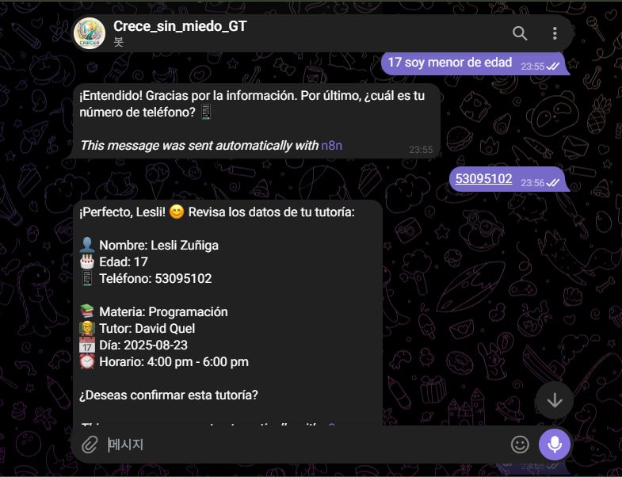
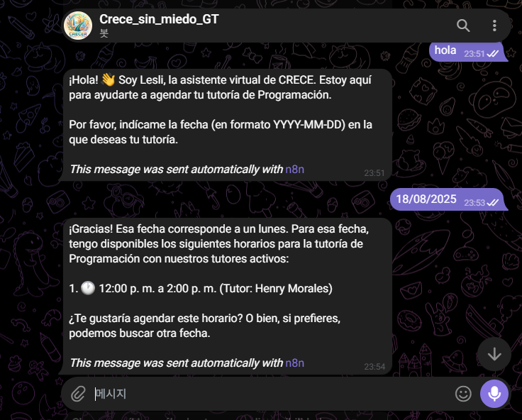
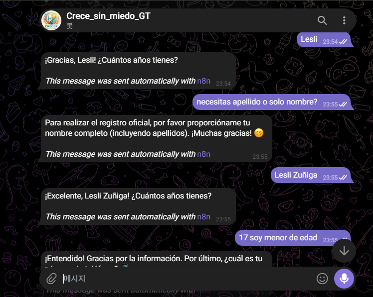
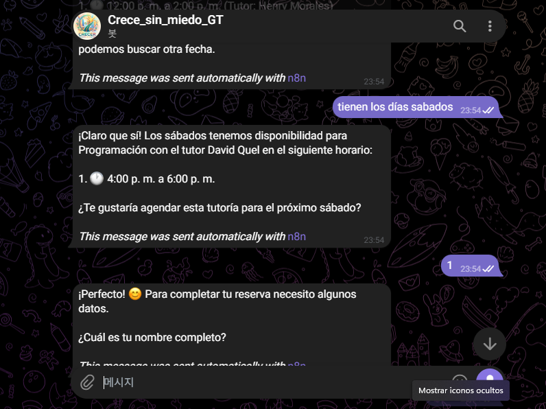
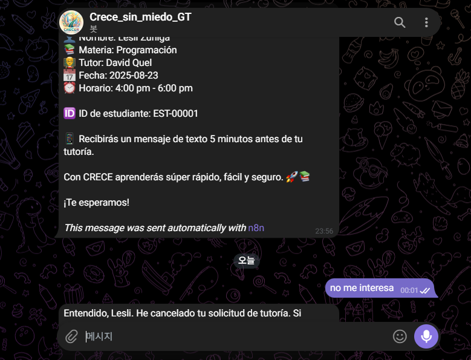
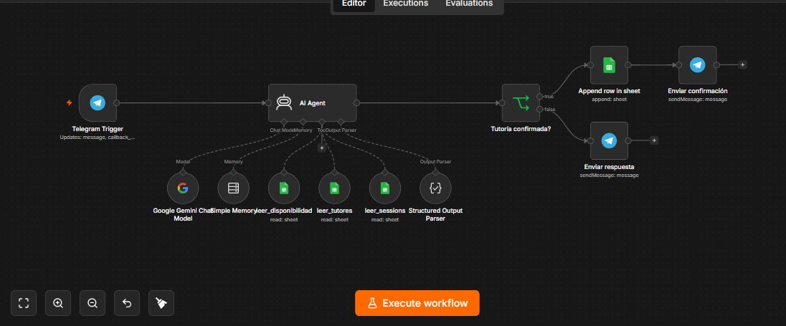

# 🤖 TutorBot CRECE

Asistente virtual estudiantil desarrollado con **n8n**, **Telegram** y **Google Sheets**, diseñado para facilitar y agilizar el proceso de inscripción y agendamiento de tutorías para los estudiantes.

El chatbot permite al estudiante consultar materias, seleccionar un día y horario disponible, proporcionar sus datos personales, revisar la información de su tutoría y confirmar su reserva.

---

## 📋 Índice

- [Descripción del proyecto](#-descripción-del-proyecto)
- [Objetivo](#-objetivo)
- [Tecnologías utilizadas](#️-tecnologías-utilizadas)
- [Funcionamiento general](#️-funcionamiento-general)
- [Flujo del chatbot](#-flujo-del-chatbot)
  - [1. Saludo](#1-saludo)
  - [2. Selección de materia](#2-selección-de-materia)
  - [3. Selección del día](#3-selección-del-día)
  - [4. Selección del horario](#4-selección-del-horario)
- [Proceso de inscripción](#-proceso-de-inscripción)
  - [Datos solicitados](#datos-solicitados)
- [Resumen de la tutoría](#-resumen-de-la-tutoría)
- [Confirmación de la tutoría](#-confirmación-de-la-tutoría)
- [Verificación final](#-verificación-final)
- [ID único del estudiante](#-id-único-del-estudiante)
- [Recordatorio](#-recordatorio)
- [Base de datos](#-base-de-datos)
  - [Tabla de tutores](#-tabla-de-tutores)
  - [Tabla de disponibilidad](#-tabla-de-disponibilidad)
  - [Tabla de reservas](#-tabla-de-reservas)
- [Estructura del proyecto](#-estructura-del-proyecto)
- [Instalación y configuración](#-instalación-y-configuración)
  - [1. Clonar el repositorio](#1-clonar-el-repositorio)
  - [2. Abrir n8n](#2-abrir-n8n)
  - [3. Configurar las credenciales](#3-configurar-las-credenciales)
- [Importación del flujo de n8n](#-importación-del-flujo-de-n8n)
- [Configuración de Google Sheets](#-configuración-de-google-sheets)
- [Configuración de WhatsApp](#-configuración-de-whatsapp)
- [Capturas del flujo](#-capturas-del-flujo)
- [Flujo de información](#-flujo-de-información)
- [Estructura JSON](#-estructura-json)
- [Validaciones del sistema](#-validaciones-del-sistema)
- [Reglas importantes](#️-reglas-importantes)
- [Ejemplo de conversación](#-ejemplo-de-conversación)
- [Integrantes](#-integrantes)
- [Entregables](#-entregables)
- [Estado del proyecto](#-estado-del-proyecto)
- [CRECE](#-crece)

---

# 📌 Descripción del proyecto

**TutorBot CRECE** es un asistente virtual creado para automatizar el proceso de gestión de tutorías estudiantiles.

El sistema permite que un estudiante pueda realizar su inscripción y agendamiento mediante una conversación desde telegram.

El chatbot consulta la información almacenada en Google Sheets para determinar:

- Materias disponibles
- Tutores disponibles
- Estado de los tutores
- Horarios disponibles
- Disponibilidad entre semana
- Disponibilidad durante el fin de semana

Después de seleccionar una tutoría, el estudiante proporciona sus datos y el sistema genera la información necesaria para registrar la reserva.

---

# 🎯 Objetivo

El objetivo principal del proyecto es **facilitar las gestiones de los estudiantes y reducir el tiempo necesario para inscribirse a una tutoría**.

El sistema busca:

- Automatizar el proceso de inscripción
- Evitar registros manuales innecesarios
- Consultar disponibilidad en tiempo real desde la base de datos
- Evitar ofrecer horarios ocupados
- Validar los datos del estudiante
- Permitir confirmar una tutoría mediante WhatsApp
- Registrar automáticamente la información de la reserva
- Generar un ID único para cada estudiante
- Informar al estudiante sobre su tutoría
- Enviar un recordatorio antes de la clase

---

# 🛠️ Tecnologías utilizadas

| Tecnología         | Función                                     |
| ------------------ | ------------------------------------------- |
| **n8n**            | Automatización y control del flujo          |
| **WhatsApp**       | Medio de comunicación con el estudiante     |
| **Google Sheets**  | Base de datos del proyecto                  |
| **JSON**           | Intercambio y estructuración de información |
| **Webhooks / API** | Comunicación entre los servicios            |

---

# ⚙️ Funcionamiento general

El funcionamiento del sistema puede representarse de la siguiente manera:

```text
              👨‍🎓 ESTUDIANTE
                    │
                    ▼
              📱 WHATSAPP
                    │
                    ▼
              ⚙️ n8n
                    │
                    ▼
          📊 GOOGLE SHEETS
                    │
        ┌───────────┼───────────┐
        ▼           ▼           ▼
     Materias    Tutores    Horarios
        │           │           │
        └───────────┼───────────┘
                    ▼
            📅 DISPONIBILIDAD
                    │
                    ▼
          👨‍🎓 DATOS ESTUDIANTE
                    │
                    ▼
              📋 RESUMEN
                    │
                    ▼
              ✅ CONFIRMACIÓN
                    │
                    ▼
            🔎 VALIDACIÓN FINAL
                    │
                    ▼
             📊 REGISTRO
                    │
                    ▼
              🆔 ID ESTUDIANTE
                    │
                    ▼
              📱 RECORDATORIO
```

---

# 🔄 Flujo del chatbot

El proceso completo está diseñado para realizarse de manera ordenada.

## 1. Saludo

El chatbot inicia la conversación identificándose como el asistente virtual de CRECE.

Ejemplo:

> ¡Hola! 👩🏻‍💻 Soy Lesli, la asistente virtual de CRECE. Estoy aquí para ayudarte a encontrar y agendar una tutoría de forma rápida y sencilla. 😊

---

## 2. Selección de materia

El sistema consulta Google Sheets para obtener las materias que tienen tutores activos.

Actualmente se manejan materias como:

- Literatura
- Programación

El chatbot no debe inventar materias.

---

## 3. Selección del día

Después de seleccionar la materia, el estudiante indica qué día desea recibir la tutoría.

El sistema determina si corresponde a:

- Día entre semana
- Fin de semana

La disponibilidad se obtiene de la base de datos.

---

## 4. Selección del horario

El chatbot muestra únicamente los horarios disponibles.

Ejemplo:

```text
Para Programación tengo estos horarios disponibles:

1. 🕐 12:00 p. m. a 2:00 p. m.
2. 🕐 4:00 p. m. a 6:00 p. m.

¿Cuál prefieres?
```

El estudiante puede seleccionar mediante el número de opción o indicando el horario.

---

# 👤 Proceso de inscripción

Después de seleccionar la tutoría, el chatbot solicita únicamente los datos necesarios.

### Datos solicitados

1. Nombre completo
2. Edad
3. Número de teléfono

Ejemplo:

```text
¡Perfecto! 😊 Para completar tu reserva necesito algunos datos.

¿Cuál es tu nombre completo?
```

Después:

```text
¡Gracias! ¿Cuántos años tienes?
```

Finalmente:

```text
Perfecto. 📱 ¿Cuál es tu número de teléfono?
```

No se solicita información adicional innecesaria.

---

# 📋 Resumen de la tutoría

Antes de realizar la reserva, el chatbot presenta toda la información recopilada.

Ejemplo basado en el flujo desarrollado:

```text
¡Perfecto, Lesli! 😊 Revisa los datos de tu tutoría:

👤 Nombre: Lesli Zúñiga
🎂 Edad: 17
📱 Teléfono: 53095102

📚 Materia: Programación
👨‍🏫 Tutor: David Quel
📅 Día: 2025-08-23
⏰ Horario: 4:00 pm - 6:00 pm

¿Deseas confirmar esta tutoría?
```

El estudiante debe confirmar antes de registrar la reserva.

---

# ✅ Confirmación de la tutoría

El chatbot no registra una tutoría hasta recibir una confirmación explícita.

Algunas respuestas válidas son:

- Sí
- Confirmar
- Sí, confirmar
- Agendar
- Quiero esa
- Confirmo

Si el estudiante decide no continuar, puede cancelar o modificar la información.

---

# 🔎 Verificación final

Antes de registrar la reserva, el sistema debe comprobar nuevamente que el horario seleccionado continúe disponible.

Esto permite evitar que dos estudiantes sean registrados en el mismo horario.

El proceso es:

```text
Estudiante confirma
        ↓
Consultar disponibilidad nuevamente
        ↓
¿Horario disponible?
    ↙          ↘
  SÍ            NO
  ↓              ↓
Registrar      Mostrar nuevas
reserva        opciones
```

---

# 🆔 ID único del estudiante

Al finalizar el proceso se genera un identificador único para el estudiante.

Ejemplo:

```text
EST-00001
```

Los siguientes estudiantes pueden recibir:

```text
EST-00002
EST-00003
EST-00004
```

El ID permite identificar la reserva y relacionarla con el estudiante correspondiente.

---

# 📱 Recordatorio

Una vez registrada correctamente la tutoría, el chatbot informa al estudiante que recibirá un mensaje de texto como recordatorio.

Ejemplo:

```text
📱 Recibirás un mensaje de texto 5 minutos antes de tu tutoría.
```

El sistema no debe indicar que el mensaje fue enviado si el servicio de mensajería no ha confirmado el envío.

---

# 📊 Base de datos

La información utilizada por el chatbot se encuentra organizada en Google Sheets.

La base de datos contiene diferentes tablas para separar la información.

---

## 👨‍🏫 Tabla de tutores

La tabla contiene:

| ID TUTOR | NOMBRE         | MATERIA      | ACTIVO/INACTIVO |
| -------- | -------------- | ------------ | --------------- |
| 1001     | Juan Mariño    | Literatura   | ACTIVO          |
| 1002     | Henry Morales  | Programación | ACTIVO          |
| 1003     | Victor Recinos | Literatura   | ACTIVO          |
| 1004     | Randolph Tecún | Programación | ACTIVO          |
| 1005     | Heidy Rojas    | Literatura   | ACTIVO          |
| 1006     | David Quel     | Programación | ACTIVO          |

El chatbot únicamente debe ofrecer tutores cuyo estado sea `ACTIVO`.

---

# 🕐 Tabla de disponibilidad

La tabla de disponibilidad contiene:

| ID DISPONIBLE | ID TUTOR | HORARIO             | DISPONIBLE SEMANA | DISPONIBLE FIN DE SEMANA |
| ------------- | -------- | ------------------- | ----------------- | ------------------------ |
| 2001          | 1001     | 8:00 am a 10:00 am  | Disponible        |                        |
| 2002          | 1002     | 12:00 pm a 2:00 pm  | Disponible        |                        |
| 2003          | 1003     | 4:00 pm a 5:00 pm   | Disponible        |                        |
| 2004          | 1004     | 10:00 am a 12:00 pm |                   | Disponible             |
| 2005          | 1005     | 1:00 pm a 3:00 pm   |                   | Disponible             |
| 2006          | 1006     | 4:00 pm a 6:00 pm   |                   | Disponible             |

---

# 📝 Tabla de reservas

La tabla de reservas inicialmente se encuentra vacía.

Cuando un estudiante confirma una tutoría, se agrega una nueva fila.

Las columnas son:

| ID ESTUDIANTES | ID TUTOR | ID MATERIAS | FECHA | HORA | PLAN | ESTADO |
| -------------- | -------- | ----------- | ----- | ---- | ---- | ------ |

Ejemplo:

| ID ESTUDIANTES | ID TUTOR | ID MATERIAS  | FECHA      | HORA        | PLAN   | ESTADO     |
| -------------- | -------- | ------------ | ---------- | ----------- | ------ | ---------- |
| EST-00001      | 1006     | [ID MATERIA] | 2025-08-23 | 16:00-18:00 | [PLAN] | CONFIRMADA |

---

# 📁 Estructura del proyecto

El repositorio debe contener como mínimo:

```text
Proyecto_TutorBot_ApellidoNombre/
│
├── README.md
│
├── TutorBot_CRECE.json
│
└── capturas/
    ├── 01-inicio.png
    ├── 02-seleccion-materia.png
    ├── 03-seleccion-dia.png
    ├── 04-seleccion-horario.png
    ├── 05-datos-estudiante.png
    ├── 06-resumen.png
    ├── 07-confirmacion.png
    └── 08-reserva-final.png
```

> Los nombres de las capturas pueden modificarse según las imágenes finales que se incorporen al proyecto.

---

# 🚀 Instalación y configuración

## 1. Clonar el repositorio

```bash
git clone URL_DEL_REPOSITORIO
```

Ingresar a la carpeta:

```bash
cd Proyecto_TutorBot_ApellidoNombre
```

---

## 2. Abrir n8n

Iniciar la instancia de n8n utilizada para el proyecto.

Una vez dentro de n8n, importar el archivo:

```text
TutorBot_CRECE.json
```

---

## 3. Configurar las credenciales

Es necesario configurar las credenciales correspondientes a los servicios utilizados.

Principalmente:

- Google Sheets
- WhatsApp
- Servicios utilizados por n8n

Las credenciales privadas no deben incluirse dentro del repositorio de GitHub.

---

# 📥 Importación del flujo de n8n

Para importar el flujo:

1. Abrir n8n
2. Ir a la opción de importar workflow
3. Seleccionar `TutorBot_CRECE.json`
4. Revisar los nodos
5. Configurar las credenciales
6. Verificar las conexiones con Google Sheets
7. Activar el workflow

---

# 📊 Configuración de Google Sheets

El proyecto utiliza Google Sheets como fuente de información.

Se deben configurar las hojas utilizadas por el chatbot.

### Hoja de tutores

Debe contener:

```text
ID TUTOR
NOMBRE
MATERIA
ACTIVO/INACTIVO
```

### Hoja de disponibilidad

Debe contener:

```text
ID DISPONIBLE
ID TUTOR
HORARIO
DISPONIBLE SEMANA
DISPONIBLE FIN DE SEMANA
```

### Hoja de reservas

Debe contener:

```text
ID ESTUDIANTES
ID TUTOR
ID MATERIAS
FECHA
HORA
PLAN
ESTADO
```

El acceso a la hoja de Google Sheets debe ser compartido con los integrantes o personas responsables del proyecto.

---

# 📱 Configuración de WhatsApp

WhatsApp funciona como el canal de comunicación entre el estudiante y TutorBot.

El flujo permite:

```text
WhatsApp
   ↓
n8n
   ↓
Procesamiento
   ↓
Google Sheets
   ↓
Respuesta
   ↓
WhatsApp
```

El estudiante no necesita acceder directamente a Google Sheets.

---

# 📸 Capturas del flujo

Las siguientes capturas documentan el funcionamiento del chatbot.

## 1. Recopilación de datos

El chatbot solicita los datos necesarios del estudiante.




---

## 2. Resumen de la tutoría

El sistema presenta los datos recopilados antes de solicitar la confirmación.




---

## 3. Confirmación

El estudiante puede confirmar la tutoría antes de que sea registrada.



---

## 4. Reserva final

Después de verificar la disponibilidad, el sistema registra la tutoría y genera el ID del estudiante.



---

# 🔄 Flujo de información

La información recopilada se procesa de la siguiente manera:

```text
DATOS DEL ESTUDIANTE
│
├── Nombre completo
├── Edad
└── Teléfono
        │
        ▼
DATOS DE LA TUTORÍA
���
├── Materia
├── Tutor
├── Día
├── Fecha
└── Horario
        │
        ▼
VERIFICACIÓN
        │
        ▼
CONFIRMACIÓN
        │
        ▼
GENERACIÓN DE ID
        │
        ▼
REGISTRO EN GOOGLE SHEETS
        │
        ▼
CONFIRMACIÓN AL ESTUDIANTE
```

---

# 🧾 Estructura JSON

Una reserva confirmada puede representarse mediante:

```json
{
  "id_estudiante": "EST-00001",
  "id_tutor": "1006",
  "id_materia": "[ID_REAL_MATERIA]",
  "fecha": "2025-08-23",
  "hora": "16:00-18:00",
  "plan": "[PLAN]",
  "estado": "CONFIRMADA"
}
```

Los valores de `id_materia` y `plan` deben obtenerse de las fuentes correspondientes del sistema.

El chatbot no debe inventar estos valores.

---

# 🔐 Validaciones del sistema

El chatbot debe realizar las siguientes validaciones:

### Materia

Debe existir en la base de datos.

### Tutor

Debe encontrarse registrado y estar en estado `ACTIVO`.

### Horario

Debe encontrarse registrado en la tabla de disponibilidad.

### Día

Debe coincidir con el tipo de disponibilidad registrado.

### Datos personales

Deben estar completos:

- Nombre
- Edad
- Teléfono

### Confirmación

La reserva no puede registrarse sin confirmación explícita.

### Disponibilidad final

El horario debe verificarse nuevamente antes de crear la reserva.

---

# ⚠️ Reglas importantes

El chatbot nunca debe:

- Inventar materias
- Inventar tutores
- Inventar horarios
- Inventar IDs
- Mostrar tutores inactivos
- Mostrar horarios no disponibles
- Registrar una reserva sin confirmación
- Sobrescribir reservas existentes
- Solicitar información innecesaria
- Confirmar el envío de un SMS sin recibir confirmación del servicio

---

# 💬 Ejemplo de conversación

### Estudiante

```text
Quiero Programación.
```

### TutorBot

```text
¡Perfecto! 💻 Tenemos tutorías de Programación.

¿Qué día te gustaría recibirla?
```

### Estudiante

```text
Viernes.
```

### TutorBot

```text
Para Programación tengo estos horarios disponibles:

1. 🕐 12:00 pm a 2:00 pm

¿Cuál prefieres?
```

### Estudiante

```text
El primero.
```

### TutorBot

```text
¡Perfecto! 😊

¿Cuál es tu nombre completo?
```

Después de recopilar los datos:

```text
¡Perfecto! 😊 Revisa los datos de tu tutoría:

👤 Nombre: Lesli Zúñiga
🎂 Edad: 17
📱 Teléfono: 53095102

📚 Materia: Programación
👨‍🏫 Tutor: David Quel
📅 Fecha: 2025-08-23
⏰ Horario: 4:00 pm - 6:00 pm

¿Deseas confirmar esta tutoría?
```

Después de confirmar:

```text
¡Listo! 🎉 Tu tutoría ha sido agendada correctamente.

📚 Programación
👨‍🏫 Tutor: David Quel
📅 Fecha: 2025-08-23
⏰ Horario: 4:00 pm - 6:00 pm

🆔 ID de estudiante: EST-00001

📱 Recibirás un mensaje de texto 5 minutos antes de tu tutoría.

¡Te esperamos! 🚀📚
```

---

# 👥 Integrantes

| Nombre          | Rol        |
| --------------- | ---------- |
| Apellido Nombre | Desarrollo |
| Apellido Nombre | Desarrollo |
| Apellido Nombre | Desarrollo |

> Los integrantes pueden modificarse según la distribución realizada por el trainer.

---

# 📦 Entregables

El proyecto debe incluir:

- [x] Repositorio de GitHub
- [x] Nombre del repositorio: `Proyecto_TutorBot_ApellidoNombre`
- [x] Archivo `README.md`
- [x] Instrucciones de instalación y configuración
- [x] Descripción del funcionamiento
- [x] Capturas del flujo
- [x] Archivo `.json` con el workflow completo de n8n
- [x] Base de datos en Google Sheets
- [x] Acceso compartido al Google Sheets
- [x] Flujo de inscripción
- [x] Validación de disponibilidad
- [x] Confirmación de reserva
- [x] Generación de ID de estudiante
- [x] Sistema de recordatorio

---

# 📈 Estado del proyecto

**Estado:** 🟢 En desarrollo / funcional

El proyecto cuenta con un flujo automatizado para facilitar la inscripción y agendamiento de tutorías mediante WhatsApp.

Se continuará documentando el funcionamiento mediante capturas de pantalla y actualizaciones del workflow de n8n.

---

# 🚀 CRECE

**TutorBot CRECE** busca convertir la gestión de tutorías en un proceso:

> **Rápido. Fácil. Seguro. Automatizado.**

📚 Aprende con CRECE.
🤖 Gestiona con TutorBot.
🚀 ¡Tu tutoría a solo unos pasos!
